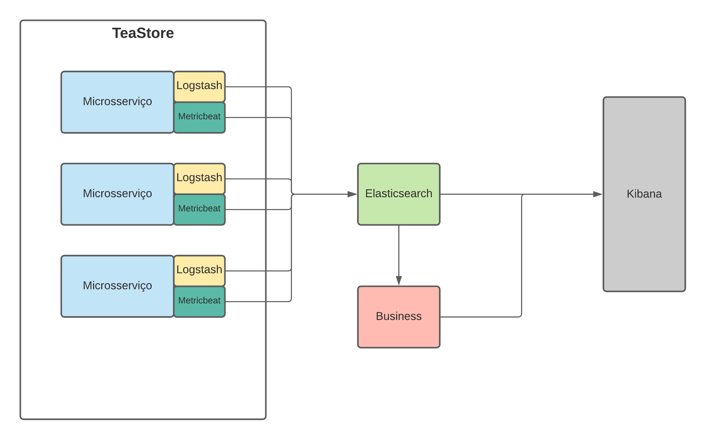

# Logs, mô?

"Logs, mô?" é uma aplicação que utiliza o [Tea Store](https://github.com/DescartesResearch/TeaStore) com o objetivo de centralizar logs, fornecer informações sobre o funcionamento dos serviços e insights de negócio.

## Arquitetura


## Dependências
*Em construção..*

## Executando o projeto
*Em construção..*

## Tecnologias utilizadas
* Docker
* Elasticsearch
* Logstash
* Kibana
* Metricbeat

### Installation

Inicialmente clone o repositorio

```sh
$ mkdir Logs_mo
$ https://github.com/emersonvictor/microservices-20203.git
```

Depois de clonar, você deve rodar o docker para iniciar a aplicação

```sh
$ docker-compose up 
```
Para mais informações segue a [documentação](https://docs.docker.com/) do Docker.
Deve levar alguns minutos para o Docker executar tudo. 
Depois de executar você deve ser capaz de acessar a aplicação via localhost

| Aplicação | localhost |
| ------ | ------ |
| Teastore* | http://localhost:8080/tools.descartes.teastore.webui|
| Elasticsearch | http://localhost:5601 |
| Rabbitmq | http://localhost:15672 |

*para mais informação ler sobre a Aplicação referência

### Rodando os testes

Você deve ter `python 3.6` ou superior para executar os testes. 
Instele as dependencias para executar os testes usando o requirements

```sh
$ pip install -r requirements.txt
```

Running

```sh
$ python stress.py 
```

## Aplicação referência
[Tea Store](https://github.com/DescartesResearch/TeaStore) é uma aplicação baseada em microsserviços para ser usada em benchmarks e testes.

## Time
1. Danilo Lira | <drla@cin.ufpe.br>
2. Emerson Victor | <evfl@cin.ufpe.br>
3. Gabriel Ramos | <grro@cin.ufpe.br>
4. Victor Sena Attar | <vsla@cin.ufpe.br>
