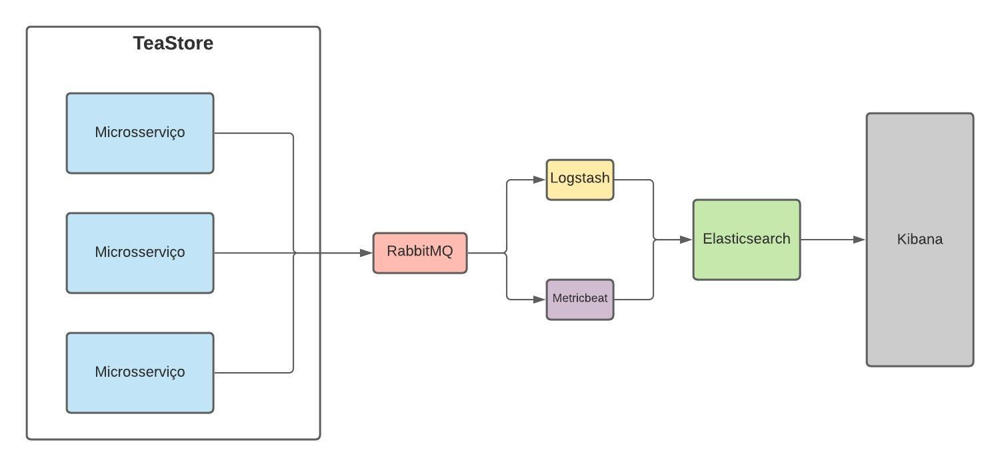

# Logs, mô?

"Logs, mô?" é uma aplicação que utiliza o [Tea Store](https://github.com/DescartesResearch/TeaStore) com o objetivo de centralizar logs, fornecer informações sobre o funcionamento dos serviços e insights de negócio.

## Arquitetura


## Dependências
1. Docker Engine| v.19.03.13 ou superior
2. Docker Compose| v.2.5.0.1 ou superior
3. Python| v.3.6 ou superior

## Tecnologias utilizadas
* Docker
* Elasticsearch
* Logstash
* Kibana
* Metricbeat
* RabbitMQ

## Executando o projeto
Clone o repositorio:

```sh
$ git clone https://github.com/emersonvictor/microservices-20203.git
$ cd microservice-20203
```

Em seguida, inicie o docker e execute o comando abaixo para iniciar a aplicação:

```sh
$ docker-compose up 
```
Após alguns minutos, você será capaz de acessar a aplicação via localhost. Seguindo os link abaixo:

| Aplicação | localhost |
| ------ | ------ |
| [TeaStore](#aplicação-referência) | http://localhost:8080/tools.descartes.teastore.webui|
| Kibana | http://localhost:5601 |
| RabbitMQ | http://localhost:15672 |

### Rodando os testes
Instale as dependências para executar os testes, executando o comando abaixo:

```sh
$ pip install -r requirements.txt
```

Para executar os testes:

```sh
$ python stress.py 
```

## Aplicação referência
[Tea Store](https://github.com/DescartesResearch/TeaStore) é uma aplicação baseada em microsserviços para ser usada em benchmarks e testes.

## Screencast
[Link para o vídeo de exemplo da aplicação]()

## Time
1. Danilo Lira | <drla@cin.ufpe.br>
2. Emerson Victor | <evfl@cin.ufpe.br>
3. Gabriel Ramos | <grro@cin.ufpe.br>
4. Victor Sena Attar | <vsla@cin.ufpe.br>
