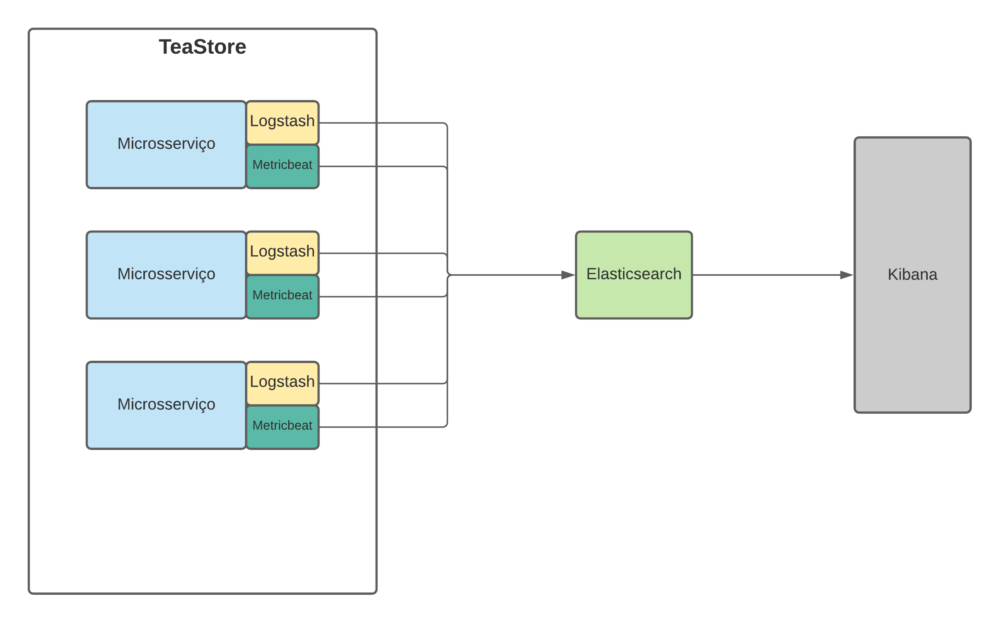

# Logs, mô?

*Em construção..*

## Arquitetura

## Dependências
*Em construção..*

## Executando o projeto
*Em construção..*

## Tecnologias utilizadas
* Docker
* Elasticsearch
* Logstash
* Kibana
* Metricbeat

## Aplicação referência
[Tea Store](https://github.com/DescartesResearch/TeaStore) é uma aplicação baseada em microsserviços para ser usada em benchmarks e testes.

## Time
1. Danilo Lira | <drla@cin.ufpe.br>
2. Emerson Victor | <evfl@cin.ufpe.br>
3. Gabriel Ramos | <grro@cin.ufpe.br>
4. Victor Sena | <vsla@cin.ufpe.br>